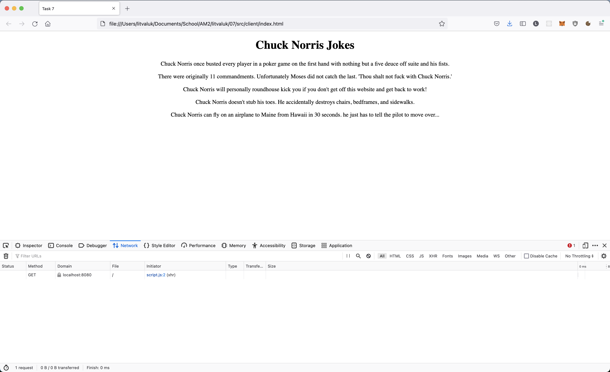

# Task 7

* Simple SSE server in Node.js that sends a Chuck Norris joke every 2 seconds using ```text/event-stream```.
* Simple client that displays Chuck Norris jokes from the server.

## How to run

* Run the server using ```node src/server/server.js```.
* Open ```src/client/index.html```.

## Screenshot
